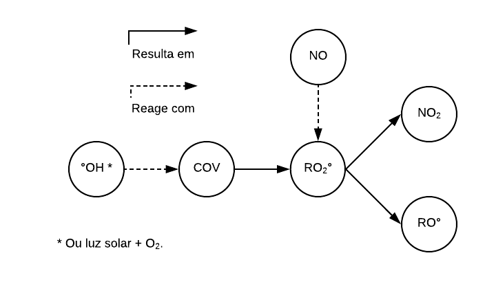

```{r setup, include=FALSE}
knitr::opts_chunk$set(eval = FALSE)
```

O ozônio não é um poluente emitido diretamente pelas fontes, mas formado na
atmosfera pela reação entre os compostos orgânicos voláteis (COVs) e óxidos de nitrogênio (NOx) em presença de luz solar. 

Os óxidos de nitrogênio, NO e NO$_2$, são lançados na atmosfera através de
processos de combustão (veicular e industrial). Já os compostos orgânicos voláteis são emitidos por processos evaporativos, da queima incompleta de combustíveis
automotivos e em processos industriais.

De forma bem simples, podemos resumir o processo gerador do ozônio pelo fluxo a seguir:

```{r}
knitr::include_graphics("img/fluxograma_ozonio_1.png")
```

Note que, ignornado outros fatores, esse processo é cíclico, isto é, começa com a fotólise do NO$_2$, que também é o produto final. Essa estacionariedade deveria impedir que a concentração de ozônio subisse muito ao londo do dia, mas há outros processos químicos interagindo com ele na atmosfera. 

Um desses processos descreve a geração de NO$_2$ a partir dos compostos orgânicos voláteis (VOC). 

```{r}

```

Observe que esse processo consome COV e NO e gera NO$_2$. É razoável supor que a interação entre esses dois processos quebra o ciclo de formação de ozônio, de tal forma que:

1. O NO que reagiria com o ozônio passa também a reagir com o peroxi radicais (RO$_2$°), gerando mais NO$_2$.

2. Sob a luz solar, mais NO$_2$ é fotolisado, gerando mais radicais Oº e, consequetentemente, mais ozônio.

3. Esse ozônio extra tem menos NO para reagir, devido ao item 1.

Dessa forma, a interação entre os dois processos geraria um aumento da concentração de ozônio troposférico.

Para avaliar essa dinâmica, vamos analisar a relação entre o NOx e o O3 na cidade de São Paulo de 2008 a 2011. Infelizmente, não temos dados de VOC.

# Pacotes

Vamos utilizar os seguintes pacotes:

```{r}
library(tidyverse)
library(modelr)
```

# Dados

Vamos carregar os dados originais.

```{r}
df <- read_csv("../data/salvo-geiger/bd_original.csv")
```

Versão enxuta do banco de dados.

```{r}
df %>%
  mutate(date = lubridate::ymd(stringr::str_c(year, monthofyear, dayofmonth, sep = "-"))) %>% 
  select(date, year, monthofyear, dayofweek, hour, dv_week_reg,
         stationno, 
         O3, NO2, NO) %>% 
  write_rds(path = "data/df_poluentes_2008_2011.rds")
```

```{r}
df_poluentes <- read_rds("data/df_poluentes_2008_2011.rds")
```

# EDA

Os dados apresentam informações de diversas estações de monitoramento. Vamos focar, inicialmente, na estação "Dom Pedro II".

```{r}
df_DPII <- df_poluentes %>%
  filter(stationno == 1)
```

Vamos visualizar o gráfico da série:

```{r}
df_DPII %>%
  gather(poluente, concentracao, O3, NO, NO2) %>% 
  ggplot(aes(x = date, y = concentracao)) +
  geom_line() +
  facet_wrap( ~ poluente, ncol = 1, scales = "free_y") + 
  geom_smooth()
```

Em 2009 e no final de 2010, observamos períodos em que altas de NO coincidem com baixas concentrações de ozônio.

Vamos ver como esses gases se comportam ao longo do dia.

```{r}
df_DPII %>%
  gather(pollutant, concentration, O3, NO, NO2) %>% 
  group_by(hour, pollutant) %>% 
  summarise(concentration = mean(concentration, na.rm = TRUE)) %>% 
  ggplot(aes(x = hour, y = concentration, color = pollutant)) +
  geom_line()
```

Observamos que o aumento da concentração de ozônio coincide com a queda da concentração de NO e NO$_2$. O nível de NO decai drasticamente, indicando que esse poluente pode estar sendo consumido nos dois processos, gerando O$_3$ e NO$_2$. Observe que a queda da concentração deste último é muito menor do que a do NO. 

O comportamento dos gases ao longo do dia sugere que a suposição sobre a interação entre os dois processos é verdadeira.
